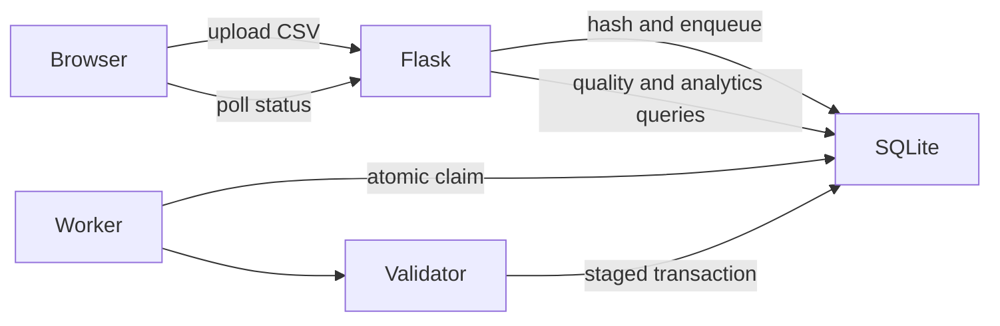

# OpsLens

OpsLens accepts transaction CSV reports, validates every row against an explicit schema, stores accepted transactions, and explains rejected data. Uploads run as persistent background jobs, so the request does not wait for parsing and loading to finish.

## Architecture



The focused deployment has a Flask web process, a Python worker process, and one SQLite database in WAL mode. No broker is required. SQLite fits the intended single-host workload and keeps local operation simple; it is not suitable for horizontally scaled web/worker fleets or sustained write concurrency. PostgreSQL would be the next step when multi-host workers or frequent simultaneous writes become requirements.

## Ingestion lifecycle

1. Flask accepts a `.csv` file up to 10 MiB, sanitizes its display filename, computes SHA-256 over the exact bytes, and inserts a `queued` job.
2. A worker atomically claims the oldest job under `BEGIN IMMEDIATE`, marks it `processing`, and releases the lock before parsing.
3. The `transactions-v1` validator requires exactly `transaction_id,timestamp,amount,category,status` and checks UTF-8, CSV structure, non-null values, ISO timestamps, finite non-negative amounts, known categories/statuses, and duplicate transaction IDs.
4. Valid rows enter a temporary staging table. One transaction creates the dataset, bulk-copies staged rows, writes quality counts and a maximum 25 rejected-row samples, then marks the job `completed`. Any error rolls the whole load back and marks the job `failed`.
5. The browser polls `/api/jobs/<id>` and displays queued, processing, completed, or failed state.

The invalid-row policy is partial acceptance: valid rows load atomically; invalid rows are counted and quarantined as a bounded sample with explicit reasons. Records are never silently discarded. Missing or unexpected columns invalidate the file because its schema cannot be determined safely.

An identical successful or active upload for the same user returns the existing job. Filename is not part of identity. Failed uploads may be retried.

## Database design

- `ingestion_jobs`: durable queue state, file hash/blob, timestamps, counts, duration, worker, and errors.
- `datasets`: one completed report and its aggregate quality counts.
- `transactions`: normalized accepted rows with a per-dataset unique transaction ID.
- `validation_results`: failure counts grouped by rule and field.
- `rejected_rows`: bounded diagnostic samples, not an unbounded error dump.
- `schema_migrations`: applied in-repository migration versions.

Foreign keys use cascades where ownership is clear. History pagination uses `(user_id, uploaded_at, id)`. Report filters use `(dataset_id, occurred_at)`, `(dataset_id, category, occurred_at)`, and `(dataset_id, status)`.

## Run locally

With Python 3.12+:

```powershell
python -m venv .venv
.venv\Scripts\python.exe -m pip install -r requirements.txt
$env:OPSLENS_SECRET_KEY = "replace-this-locally"
.venv\Scripts\python.exe -m flask --app app run
```

In a second terminal:

```powershell
.venv\Scripts\python.exe -m app.worker
```

Or run both processes with a shared persistent volume:

```powershell
$env:OPSLENS_SECRET_KEY = "replace-this-locally"
docker compose up --build
```

Open `http://localhost:8000`. `/health` checks the web process and `/ready` verifies database access. The worker logs job IDs, duration, accepted/rejected counts, and failures as searchable key-value fields. Jobs left processing for 30 minutes are recovered when a worker starts.

## Tests and benchmarks

```powershell
.venv\Scripts\python.exe -m pytest -q
.venv\Scripts\python.exe -m benchmarks.benchmark
```

Tests cover valid and invalid schemas, malformed rows, type/missing/duplicate rules, quality persistence, idempotency, rollback after staging, successful/failed status, single claiming, uploads, file types, pagination, password hashing, health, and readiness. CI installs pinned dependencies, compiles Python sources, and runs the same tests.

The benchmark generates deterministic data; it does not use the untracked sample reports. It compares the same queries without and with the production indexes over 100,000 rows (25 repetitions), and measures the validation plus load path at 1,000, 5,000, and 10,000 rows. Local results from 2026-08-23 are in [benchmarks/results.md](benchmarks/results.md):

- time-range median: 25.855 ms before, 18.662 ms after
- category-range median: 19.125 ms before, 14.397 ms after
- status aggregate median: 18.860 ms before, 5.653 ms after
- ingestion throughput: 3,456.3 rows/s at 1k; 5,586.8 at 5k; 10,702.8 at 10k

These figures describe one local run, not a production capacity guarantee.

## Operational limitations

- The database and worker fleet must stay on one host with a shared local filesystem. Use one worker for predictable SQLite write behavior; atomic claiming prevents double processing but does not remove SQLite's single-writer limit.
- CSV data is held in memory during validation, bounded by the 10 MiB request limit. Larger streaming workloads need a different parser/storage boundary.
- Job polling is intentionally simple; there are no WebSockets.
- Rejected-row storage is diagnostic and capped at 25 rows, while all failure counts remain available.
- The tracked legacy `data/opslens.db` is migrated in place. Back it up before using a new application version against important data.
